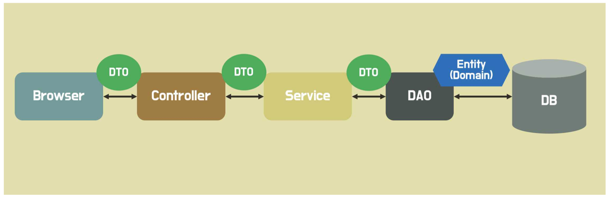
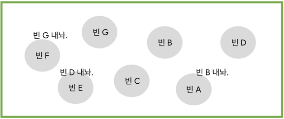

# 백엔드 정규 스터디 2주차: 계층형 아키텍처와 컨트롤러, 서비스

## Layered Architecture

* Browser = Client(손님)
* Controller = 웨이터, Service와 소통으로 요리 시킴
* Service = 주방장, DAO와 소통으로 재료 받음
* DAO = 창고 관리인, DB에서 재료 꺼냄
* DB = 냉장/냉동 창고
* DTO(Data Transfer Object) = 주문서, 주문에 필요한 정보만 포함
* Entity = 원재료, 모든 정보 포함

## Controller Layer
**HTTP 요청 / 응답 처리**
* HTTP body에 json형태로 응답한다.

### Controller 구현 방법
1. Controller 어노테이션 
2. @Responsebody 어노테이션 
3. @RestController 어노테이션 
4. 생성자 주입(서비스 계층에 의존)
5. @RequestMapping를 통해 method, url 지정. 
6. 공통 URL & 상세 URL
7. @RequestBody를 통해 json 데이터 받아오기

### 패키지 구조 : 계층형 vs 도메인형
1. 계층형 구조 : 애플리케이션을 기능별로 나눈다.
    * c.f. Controller는 Controller에, Service는 Service에!
2. 도메인형 구조 : 도메인 관련 모든 클래스를 포함
   * 도메인 단위로 개발하여, 특정 도메인의 코드를 한 곳에 저장

**우리는 도메인형 구조 사용**

### 상태코드(status code)
1. 200 OK [처리 **성공**]
2. 201 Created [데이터 생성 **성공**]
3. 204 No Content [요청 **성공** but 보내줄 **콘텐츠 없음**] = Delete 통한 영구 삭제 
4. 400 Bad Request [클라이언트 요청 **오류**]
5. 404 Not Found [요청 데이터 없음 **오류**]
6. 500 Internal Ser ver Error [서버 **에러**]

## Service Layer
**비즈니스 로직**
* 원자성(atomicity)를 가짐 : 메서드 실행 시, 쪼갤 수 없는 상태를 가짐.
* -> 트랜잭션 단위로 처리해야 한다.
* -> 서비스 계층 메서드 위에 @transactional을 붙인다.

## Service 구현 방법
1. 생성자 주입
2. @transactional [2주차: 주석 처리]
3. (readOnly = true) 옵션

## 스프링 빈 & 의존성 주입

## 스프링 빈
* 빈은 빈만 요구 가능
* 빈 등록 방법 중 컴포넌트 스캔으로 자동 등록 가능
  1. 빈 등록하고싶으면 @Component 붙이면 됨
  2. 스캔은 @ComponentScan으로 하면 됨

* @ComponentScan는 @SpringBootApplication에 포함됨.
* @Component는 우리가 사용하는 @Controller, @Service, @Repository, @Entity 등에 포함됨
* 이것들을 사용하면 @ComponentScan이나 @Component를 굳이 사용 안해도 된다.

## 의존성 주입
내가 의존하는 객체를 직접 생성하지 않고 밖에서 **주입**받는 것

빈은 빈으로만 사용 가능

### 사용하는 이유
: 객체를 매번 생성하는 것보다, 한번 생성해둔 객체를 컨테이너 안에 넣고, 빈으로 만들어서 필요할 떄만 사용하는 것이 효율적이므로

### 사용 방법
1. 생성자 주입 : final(변수에 한 번만 값 할당 가능)로 선언
   / 생성자에 @Autowired로 빈을 주입한다(생성자가 only one이면, 생략 가능)
2. 필드 주입 : 다음 강의 때
3. 수정자 주입(Satter) : 다음 강의 때

### 생성자 주입 간단 방법
1. 필요한 의존성에 final 키워드 추가
2. @RequiredArgsConstructor를 사용해 생성자 추가