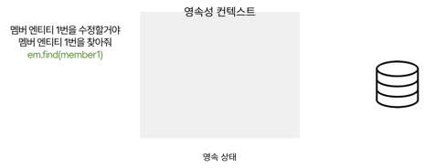

# 백엔드 정규 스터디 3주차: JPA와 레포지토리
## 레포지토리(Repository)
Repository : 데이터베이스에 접근하여 **CRUD** 작업을 수행하는 계층
1. Create : 데이터 **생성**
2. Read : 데이터 **조회**
3. Update : 기존 데이터 **수정**
4. Delete : 기존 데이터 **삭제**

- DB 접근 방법 : 
1. **애플리케이션 서버**가 DB가 이해할 수 있는 **SQL**을 연결된 커넥션을 통해 DB에 전달 
2. DB는 전달된 SQL을 수행하고, 그 결과를 응답

### **JDBC** : Java에서 DB에 접근하기 위한 표준화된 API
같은 방식으로 특정 DB에 종속되지 않고 코드 작성 가능(내부적으로 JDBC가 각 DB에 맞는 드라이버를 통해 SQL 전달)

*BUT, SQL을 직접 다루는 방식은 여러 단점이 있다*
-> ORM 기술로 해결
## ORM
ORM(Object-relational Mapping) : 객체와 관계형 DB의 데이터를 자동으로 매핑해주는 것
### JPA(Java Persistence API) : 자바 진영의 ORM 기술 표준
자바에서 객체를 DB에 저장하고 관리하기 위한 Interface와 기능을 제공하는 API(대표적 JPA 구현체 : Hibernate)

*JPA : Just Interface -> 이 인터페이스를 구현하는 것 : Hibernate*
## JPA의 동작 방식
JPA의 기능 대부분은 EntityManager를 제공함
### EntityManager : Entity 객체를 DB에 연결해주는 창구 역할
EntityManager를 사용해서 SQL을 직접 작성하지 않고, Entity를 DB에 등록/수정/조회/삭제 가능
- EntityManager는 Entity를 **영속성 컨텍스트**에 저장

### 영속성 컨텍스트 : JPA에서 Entity를 관리하기 위해 만든 가상 공간
EntityManager를 통해 영속성 컨텍스트에 접근 가능
- Entity 생명 주기(영속성 컨텍스트에 의해 관리됨)
1. 비영속 : 영속성 컨텍스트와 **관련 없는** 상태
2. 영속 : 영속성 컨텍스트에 **저장**된 상태. Entity가 영속성 컨텍스트에 의해 관리됨
3. 준영속 : 영속성 컨텍스트에 저장되었다가 **분리**된 상태
4. 삭제 : 영속성 컨텍스트에 Entity가 삭제**될 것**이라고 기록한 상태
- 영속성 컨텍스트 특징(장점)
1. **1차 캐시** : 한번 조회한 객체를 영속성 컨텍스트가 내부에 저장해두고 재사용하는 구조
2. **동일성 보장** : 트랜잭션 안에서 같은 Entity를 여러번 조회해도 영속성 컨텍스트에 보관된 같은 객체를 그대로 반환
3. **변경 감지** : 영속성 컨텍스트가 Entity의 변경 사항을 자동으로 감지(영속 상태여야만 감지)
4. **트랜잭션**을 지원하는 쓰기 지연
   - 트랜잭션 : DB에서 수행되는 작업의 단위
   - c.f. (주문 정보 저장 & 상품 재고 차감 & 회원 포인트 적립)을 하나의 트랜잭션으로 묶음.
## Entity를 CRUD하는 과정

> 대충 이런 형태(영속성 컨텍스트를 지나쳐서 DB에 가게된다.)
### 1. Entity member1 등록 : em.persist(member1)
- em(=EntityManager)을 통해서 persist(member1)을 호출
- persist : 영속성 컨텍스트에 등록하는 명령어 -> member1는 이제부터 JPA가 관리하는 영속상태가 된다.
### 2. 동일하게 member2 등록 : em.persist(member2)
- 영속성 컨텍스트에 member1, member2가 존재하게 된다.
### 3. 트랜잭션 커밋 : em.flush()
- JPA가 내부적으로 이 함수를 자동으로 실행
- flush() : 모아놓은 SQL들을 DB에 한꺼번에 보냄
> 트랜잭션을 지원하는쓰기 지연 : DB에 바로 보내는 것이 아니라 모아놨다가 커밋 시점에 한 번에 묶어서 DB에 보내는 구조 -> 성능 최적화
### 4. Entity 조회 : em.find(member1)
- 먼저 영속성 컨텍스트 내부에서 Entity 찾는다.
- 그 후, 직접 DB에서 Entity를 조회
- DB에서 조회한 Entity를 영속성 컨텍스트에 올리고, 이 멤버 Entity릃 반환한다.
### 5. 동일 Entity 한번 더 조회 : em.find(member1)
- 영속성 컨텍스트 내부에 Entity를 찾는다. -> 이미 있으므로 이 객체를 그대로 반환(1차 캐시 & 동일성 보장)
### 6. Entity 수정(이름과 주소) : 
- em.find(member1) 
- 이름과 주소 수정
- em.flush() : 영속성 컨텍스트가 Entity들의 변경 전 상태와 현재 상태 비교 -> 어떤 Entity가 수정되었는지 체크
- 변경 내용을 반영하기 위해, 영속성 컨텍스트가 UPDATE 쿼리 생성하여 DB에 전달(변경 감지)
### 7. Entity 삭제
- em.find(member1) : Entity를 영속 상태로 만든다
- em.remove(member1) : Entity를 삭제 대상으로 표시하고, 영속성 컨텍스트에서 더이상 관리X, 
- BUT 보관하다가 flush() 시, DB에 DELETE SQL 전송

# 정리
1. JPA는 엔티티 매니저를 통해 엔티티를 영속성 컨텍스트라는 공간에서 관리한다.
2. 변경 내용을 즉시 DB에 반영하지 않고 모아두었다가, 트랜잭션이 커밋될 때 필요한 SQL을 한 번에 실행한다.
3. 엔티티의 변경을 자동으로 감지해 SQL을 생성하고, 데이터베이스와 동기화를 수행한다.
4. 이미 조회된 엔티티는 영속성 컨텍스트에 저장되어 동일 트랜잭션 내에서 재사용된다.