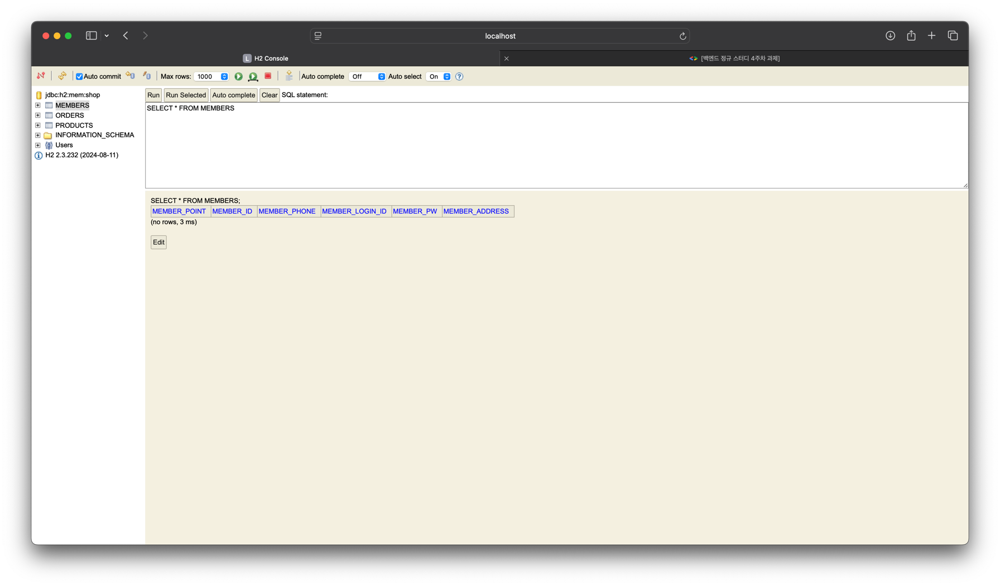
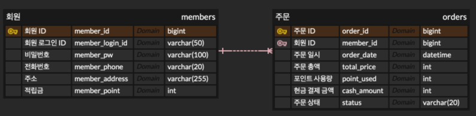
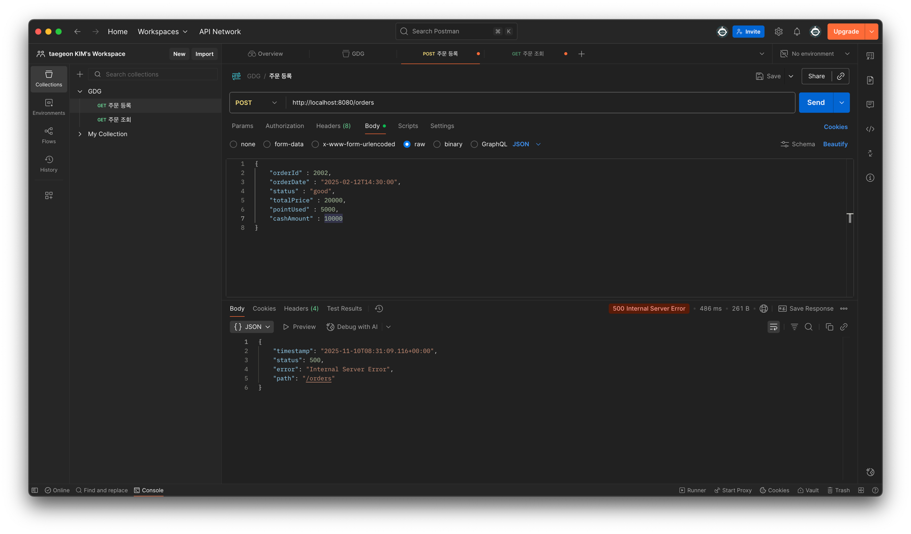
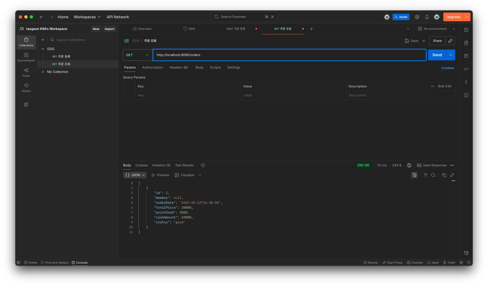

# 백엔드 정규 스터디 4주차: ERD, DB, 엔티티

# 이번주 스터디 목표
개념들을 전체적으로 이해하고 흐름을 따라가자!

## ERD(Entity-Relationship Diagram)
- Entity : 데이터를 가진 대상
- Relation : 개체(Entity) 사이의 연관성
### 핵심 용어
1. 엔티티(Entity) : 관리해야 할 데이터 주체 c.f. Member, Product, Order
2. 속성(Attribute) : 각 엔티티가 가지는 구체적 정보 c.f.Field, Column
3. 기본키(Primary Key, PK) : **고유하게 식별**하는 데 사용되는 하나 이상의 컬럼(필드)
4. 외래키(Foreign Key, FK) : 다른 테이블의 PK를 참조(저장)하는 속성(컬럼)
5. 관계(Relation) : 개체(Entity) 사이의 연관성, 업무 규칙
    - 다대일(N:1), 일대다(1:N), 일대일(1:1), 다대다(N:N)
    - 다대다 일 때는 중간 테이블(연결 Entity)를 도입해서 해결(**테이블**로 관계 구현)

일대다 : 1명의 회원은 여러 개의 주문 내역을 가진다.
- **외래 키(FK)로 관계를 구현!**

다대다 : 한 명의 학생은 여러 개의 강의를 수강 가능, 하나의 강의는 여러 명의 학생이 수강 가능
- 일대다 처럼 FK로 해결하면 문제 발생! -> 중간 테이블을 도입하여, **테이블로 관계를 구현**

> "endcloud.com"에서 시각화할 때, 비식별 관계(Non-Identifying Relationship)을 선택하자

## JPA
### Entity : 자바와 DB가 소통하는 단위
우리는 엔티티 클래스를 정의해주면 JPA가 알아서 **테이블 생성 SQL문**을 작성하고 실행해준다.
- c.f. 레포지토리 계층 : CRUD SQL
### JPA & DB 의존성 추가
DB : H2 데이터베이스 사용(WHY? 가벼움)
- build.gradle에 JPA, H2 Database 의존성을 추가하자
### DB 연결 정보 추가
- application.properties 를 application.yml 파일 형식으로 수정해준다.

# 느낀점
이번 강의를 들으면서, 계속 실습을 하지 못했던 이유를 알게 되었다!! 바로 Member를 내가 만든 Member.java룰 사용하는 것이 아닌, 이 프로그램에 내장된 Member를 사용했기 때문이다.

그냥 빨간 줄이 뜬다고 **클릭하고 해결**만 하지 않고, 그 이유를 반드시 알아내고 스스로 해결하는, 주도적인 자세를 가져야겠다고 다짐했다.
# 과제
## H2_table

## DB ERD

## Postman을 통한 API 테스트
### 실패

### 성공
